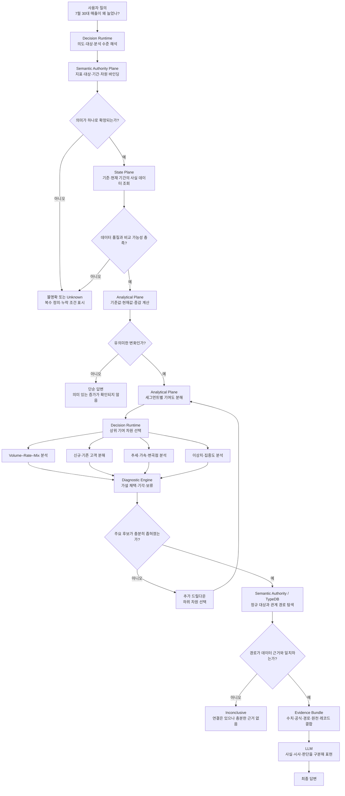

> **지위**: superseded by [archi-2.md](archi-2.md) (2026-08-12). 문제의식은 archi-2 §1에
> 보존, 다이어그램의 C3·H1·C4·중앙값 연산자는 archi-2 §7의 사유로 폐지·재작성됨.
> 본 문서는 역사 기록으로 동결한다.

# 문제의식

0. 그래프 경로 기반의 정형 데이터 에이전트가 숫자 변동 뒤에 숨은 원인을 설명함(그래프 경로를 활용해 숫자 뒤에 얽힌 고객, 제품, 채널의 관계를 보여주는 것을 핵심 차별점)

1. 전체 변화를 세그먼트별로 쪼개어 가장 큰 동인과 상쇄 요인을 찾아내는 기여도 분해다.
2. 개별 단가가 오른 것인지 비싼 제품이 많이 팔린 믹스 효과인지를 구분하는 Mix vs Rate 분석이다. 
3. 단순 수치 나열을 넘어 가속, 감속, 변곡점을 잡는 추세 분석이다. 
4. 극단값이 평균을 끌어올려 자신을 숨기는 현상을 막기 위해 중앙값 기반 지표를 쓰는 이상치 및 집중도 탐지다. 
5. 현장의 요청을 반영해 데이터 밖의 컨설팅 가이드도 함께 제공
6. 문장마다 데이터 확인, 데이터 시사, 컨설턴트 판단이라는 라벨링
7. 사실과 추론, 경험에 기반한 가이드의 경계를 명확히 분리하여 신뢰도 확보
8. SQL 집계 데이터로 정량 진단을 내리고, 그 뒤에 그래프 DB의 관계 경로를 붙여 구체적인 실체 사례를 증명하는 협력 구조
9. 질문 의도에 따라 시스템이 스스로 가설을 세우고, 기각된 가설까지 포함하여 단계별로 파고드는 드릴다운 루프 

이 계산 체계는 유통뿐만 아니라 보험의 손해율 분해, 의료의 총진료비 분석, 제조의 불량 원인 추적처럼 다양한 산업 영역에 그대로 적용 가능하다.
 
예를 들어 ‘30대가 늘었다’는 단편적인 데이터 읽기에서 벗어나, 이 증가의 62%는 온라인 채널 신규 고객이 설명하며 그중 A사가 B제품을 통해 유입되었다고 진단할 수 있는 엔진으로 발전시켜 나가고자 한다.

# 문제 해결 다이어그램

