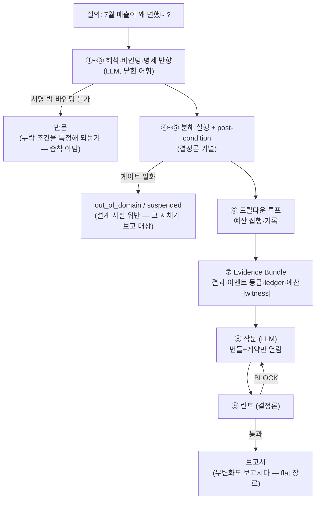

# archi-2 — 지표 변화 설명 엔진의 정본 아키텍처

> **지위**: 정본. [archi-1.md](archi-1.md)를 대체한다 (2026-08-12). archi-1의 문제의식
> 은 전부 보존하되, 메커니즘 서술을 이후 확정된 교리 — 연산자 레지스트리, 정보 경계
> 지도, 보고서 계약 v0.1, ADR-0001~0005 — 와 정합하게 재작성했다. archi-1과의 차이는
> §7에 명시적으로 기록한다 (5렌즈 방향성 검토, 2026-08-10: canonical화 반대 — 후속
> 교리와 4개 모순).

---

## 1. 문제의식 (archi-1에서 보존)

지표가 움직였을 때 "왜"를 설명하는 일은 BI 도구의 조회·시각화와 데이터 과학의
모델링 사이에 버려져 있다. 이 틈을 메우는 엔진의 요건 9개 — archi-1이 세운 것,
그대로 유효하다:

| # | archi-1의 요건 | 현행 교리에서의 자리 |
|---|---|---|
| 0 | 그래프 경로로 숫자 뒤의 실체(고객·제품·채널 관계)를 보인다 | **witness 계약** (§5.3) — 계약 먼저, 엔진 유예 |
| 1 | 기여도 분해 — 최대 동인·상쇄 요인 | 커널 `contrib_decomp` + 검산 (④~⑤) |
| 2 | Mix vs Rate 구분 | 커널 `vrm_lite`, 레지스트리 VRM 연산자 |
| 3 | 추세·가속·변곡점 | 레지스트리 등록 후보 (미구현 — §8) |
| 4 | 이상치·집중도 (중앙값 기반) | **연산자 폐기 → 트리거로 강등** (§7.4, ADR-0004) |
| 5 | 데이터 밖 컨설팅 가이드 | '컨설턴트 판단' 라벨 + 근거 역참조 의무 |
| 6 | 문장 라벨링 (확인/시사/판단) | **4라벨** + 렌더링 사전 (§5.1 — 참고치 추가) |
| 7 | 사실·추론·경험의 경계로 신뢰 확보 | 계약 §4 인과 어법 경계 + 린트 R01~R12 |
| 8 | SQL 집계 진단 + 그래프 경로 실체 증명의 협력 | 집계=본진, 경로=witness (§5.3) |
| 9 | 가설 드릴다운 루프, 기각 가설 포함 | 탐색 예산 집행·기록 + 기각의 규칙 (계약 §9) |

산업 일반성(보험 손해율, 의료 총진료비, 제조 불량)과 목표 예시("30대 증가의 62%는
온라인 신규가 설명하며, 그중 A사가 B제품으로 유입")도 보존한다 — 단, 후자의
"A사가 B제품으로 유입"은 witness(실체 예시)이지 인과 판정이 아니라는 것이 §5.3의
경계다.

## 2. 목표는 목록이 아니라 좌표계다

archi-1의 요건들은 기법 목록이었다. 정본은 기법을 **좌표계 위의 점**으로 등록한다:

- **질문 서명** — 질의는 닫힌 어휘로 (질문 유형 × 외부 기준 유무 × 바인딩)에 사상된다.
  서명이 연산자를 선택하지, 기법 이름이 선택하지 않는다. ([operator-registry-v1.md](operator-registry-v1.md))
- **연산자 등록 스키마** — 모든 분석 기법은 전제조건·출력 타입·post-condition·라벨
  상한을 갖고 등록된다. 등록되지 않은 계산은 지면에 오를 수 없다.
- **정보 산출물 경계** — 엔진이 내는 것/기록만 하는 것/영구히 내지 않는 것의 지도.
  ([info-catalog-map.md](info-catalog-map.md), §6 요약)

최종 산출물은 판정이 아니라 **증거 패키지(Evidence Bundle)와 계약된 보고서**다.
인과는 계산되지 않고 등급화된다 (§5.3).

## 3. 아키텍처 — 샌드위치 ①~⑨

LLM은 양 끝에만 있고, 가운데는 결정론이다. ①~③(해석)과 ⑧(작문)이 LLM 슬롯,
④~⑦(커널)과 ⑨(린트)는 코드다. LLM이 숫자를 만들 수 있는 지점은 0곳이다.

```
① 해석      질의 → 질문 서명 (닫힌 어휘 — 서명 밖 질의는 반문으로 회복)
② 바인딩    지표@버전·기간·비교 기저·범위 확정, 기본값 명시
③ 명세 반향  "이렇게 이해했습니다 — …" 사용자에게 반향, 이후 전 과정은 명세에 구속
─── 여기부터 결정론 ───
④ 분해 실행  게이트(설계 사실) 통과 시에만 — 실패는 out_of_domain/suspended로 종결
⑤ 검사      post-condition: 검산(별도 경로)·커버리지·범위 선언 대조 (ADR-0002)
⑥ 드릴다운   탐색 예산(depth·세그먼트 수) 집행·기록 — 루프 종료는 예산과 계약 깊이가 결정
⑦ 번들 조립  결과 + 이벤트 대조(등급 부여, 판정 아님) + 가정 ledger + 예산 기록 + [witness 슬롯]
─── LLM 슬롯 ───
⑧ 작문      번들+계약만 열람 (표본·린트 내부 차단), 라벨은 종결어미로 렌더링
─── 결정론 ───
⑨ 린트      어미→라벨 역검사, 수치 출처 대조(R06), 인과 어법 차단 (R01~R12)
```



archi-1 다이어그램과의 구조적 차이: 유의미성 종료 게이트(C3)와 가설 판정
엔진(H1)이 없다. 이유는 §7.

## 4. 전제조건의 이원화 — 게이트와 ledger

연산자의 전제는 두 재질로 나뉜다 (레지스트리 교리):

- **설계 사실** (파티션 완전성, MECE, 빈티지 지정, 스키마 커버리지) → **게이트**.
  위반 시 실행 자체가 거부된다(out_of_domain/suspended). 거부는 실패가 아니라
  산출물이다 — fall_dirty 시나리오에서 전 축 차단이 정답 행동으로 채점된다.
- **데이터 의존 가정** (세그먼트 구성 안정성, 신고치 정확성) → **가정 ledger**.
  검사 불가면 unchecked로 지면에 남는다. 침묵으로 전제를 소비하지 않는다.

빈티지 축이 대표 사례다: 계획·예측은 **기록하고 채점하는 층이지 만드는 층이
아니며**, 빈티지 미지정 plan_gap 호출은 게이트가 거부한다 (Track 1 구현).

## 5. 신뢰의 3장치

### 5.1 라벨 4종 — 태그가 아니라 종결어미

데이터 확인 / 데이터 시사 / 컨설턴트 판단 / **참고치** (archi-1의 3라벨에서 확장).
라벨은 지면에 관료적 태그로 찍히지 않고 종결어미·서술어 선택으로 구현되며
([report-contract-v0.md](report-contract-v0.md) §3), 린트가 역방향(어미→라벨)으로
검사한다. 참고치는 "숫자를 지면에 올리지 않는 것 자체가 표기법"인 라벨이다.

### 5.2 인과는 계산이 아니라 등급화

이벤트-슬라이스 대조는 등급만 부여한다: **산술로 닫힘**(금액 특정+항등식) →
확인급 등호 서술 / **규모 특정** → 선언 대조 병기 / **시사 상한**(기간·세그먼트·
규모 정합 ≥1) → 헤지 의무 / **차단**(잔차 논법·배타 단정). 등급의 정당성은 원인
주입 채점으로 실증됐다: 슬라이스 실측 Δ는 참 효과를 2~3배 과대하며(E2 귀속갭
-12.2억), 이것이 시사 '상한'이 존재하는 이유다 (ADR-0001, scorecard).

### 5.3 witness 계약 — 그래프의 자리

archi-1의 차별점(그래프 경로)은 **witness**로 정식화된다: 집계 진단이 본진이고,
그래프 경로는 그 진단의 실체 예시(어느 고객·제품·거래가 그 셀에 있는가)를 붙인다.
**경로의 존재는 '확인', 경로에 얹는 설명 언명은 '시사' 이상 불가** (legacy-notes).
witness는 ⑦의 계약된 슬롯로 예약하되 엔진 구현은 유예한다 — 계약 없이 엔진부터
만들면 경로가 인과 서사로 승격되는 것을 막을 수 없기 때문이다 (5렌즈 검토 결론).

## 6. 경계 — 내는 것과 영구히 안 내는 것

- **v1** 조회·기술·귀속(분해·드릴·VRM) — 결정론적 산술의 왕국, 확률 소비 0.
- **v1.5** 계획 대비 축 + 예측 채점 — 빈티지·불변 기록 인프라가 국경.
- **v2** 증거 패키지 + 사전 등록 스캔 + 실험 판독(트랙 E: Fisher 무작위화 검정,
  할당 계약, SRM).
- **영구 제외**: 인과 판정, 계산된 처방("얼마를 더 생산하라"), 자동 실행. 실제
  시험받을 국경은 인과가 아니라 최적화 쪽이다 — gap 정량화까지가 영토다.

## 7. archi-1과의 차이 — 4개 모순의 해소

1. **C3 "유의미한 변화인가?" 종료 게이트 → 폐지.** δ_min은 유래가 없는 자의
   문턱(미결)이고, 통상 변동 대역은 계절 진폭에 지배되어 검정력이 없음이
   실측됐다(-37.5억 충격도 '통상 범위 내' — ADR-0004). 유의미성은 조기 종료
   조건이 될 수 없다. 대역은 **설명 요구 트리거·ledger 진단 항목**으로 강등되고,
   무변화(flat)도 정식 보고서 장르다 — "의미 있는 증가가 확인되지 않음"이라는
   단순 답변 출구는 없다.
2. **H1 "가설 채택·기각·보류" 진단 엔진 → 폐지.** 엔진은 판정하지 않는다.
   커널은 등급을 부여하고(§5.2), 채택·기각은 보고서의 '판단' 라벨 문장으로만
   존재하며 반증 수치가 의무다(R09). 자동 판정 금지는 영구 제외 경계(§6)의
   내부 복제다 — 판정 다이아몬드를 파이프라인 안에 두면 경계는 무너진다.
3. **C4 "충분히 좁혀졌는가?" → 3분리.** archi-1은 한 다이아몬드에 세 결정을
   뭉쳤다: (a) 탐색 예산 소진 — 집행·기록되는 자원(⑥), (b) 증거 등급 도달 —
   라벨 상한(§5.2), (c) 분해 깊이 — "독자 질문에 답하는 최소 깊이"라는 계약
   규범. 셋은 주체도 재질도 다르다: (a)는 커널이 집행하고, (b)는 커널이 기록하되
   작문이 소비하고, (c)는 계약이 정한다.
4. **중앙값 이상치 연산자 → 폐기.** median±3·MAD 대역은 n=5 월간 이력에서
   통계적으로 무의미하고 대역 폭이 계절 진폭과 일치함이 실증됐다(ADR-0004).
   이상치·집중도의 문제의식은 부호 혼재 축의 share_of_change 억제 규칙과
   레지스트리 등록 후보(계절조정 전제 게이트 포함)로 보존된다.

부수 변경: X1(불명확 → 종착)은 **반문**(누락 조건을 특정해 되묻는 회복 경로)으로
교체(interpret.py 구현), 3라벨은 4라벨로 확장(§5.1), "LLM이 사실·시사·판단을
구분해 표현"(L1)은 "계약이 어미를 정하고 린트가 역검사한다"로 기계화됐다.

## 8. 검증 교리와 미결

검증은 **원인 주입 전방 생성**이 정본이다(ADR-0001) — 정답지에서 데이터를
역생성하는 순환이 아니라, 알려진 개입을 심고 leave-one-out 반사실로 참 규모를
정의해 복원을 채점한다. 같은 루프·같은 필터를 공유하는 검산은 검증이 아니며
(identity_recheck 2회 항진식 — ADR-0002), 신고치는 오염이 기본값이다(ADR-0005).

⑧루프 N=20 측정은 완료됐다(2026-08-12, [../slice/out/loop8/findings.md](../slice/out/loop8/findings.md)):
계약 위반 실질 0%, 인식론 결론(몸통 귀속·기권·조건부 헤드라인)은 20/20 재현,
분산은 형태·주변 수치에만 존재. 명목 BLOCK 6건은 전수 린트 오탐으로 판정되어
린트 2건(R06 파생치·R09 불릿 단위)이 수리됐다 — ⑧루프는 ⑨린트의 시험기다.

미결 (우선순위순):
- 실데이터 온보딩 비용 실측 — 지식 획득 병목이 최대 제품 리스크
- rise/flat/fall_dirty 번들로 장르×시나리오 확장 측정 — 상승 어법(계약 §12-1) 시험
- 환불(음수) 행 무게이트 (부호 규범 미검사), δ_min의 유래 부재
- 추세·변곡 연산자, witness 엔진(계약 확정 후)
- 계약 v0.1 조항 1~4의 린트 구현 — N=20에서 100% 준수 확인, 회귀 방지용 백로그
- 주별 연산자 2막 드릴다운(주별 데이터는 원장에 존재)

---

*계보: [archi-1.md](archi-1.md)(문제의식) → [legacy-notes.md](legacy-notes.md)(P1~P8·
함정 대장) → [operator-registry-v1.md](operator-registry-v1.md)(좌표계) →
[info-catalog-map.md](info-catalog-map.md)(경계) → [report-contract-v0.md](report-contract-v0.md)
(작문 계약) → [adr/](adr/)(검증 교리). 본 문서는 이들의 합의를 한 장으로 정본화한
것이며, 충돌 시 개별 문서가 아니라 본 문서를 갱신한다.*
