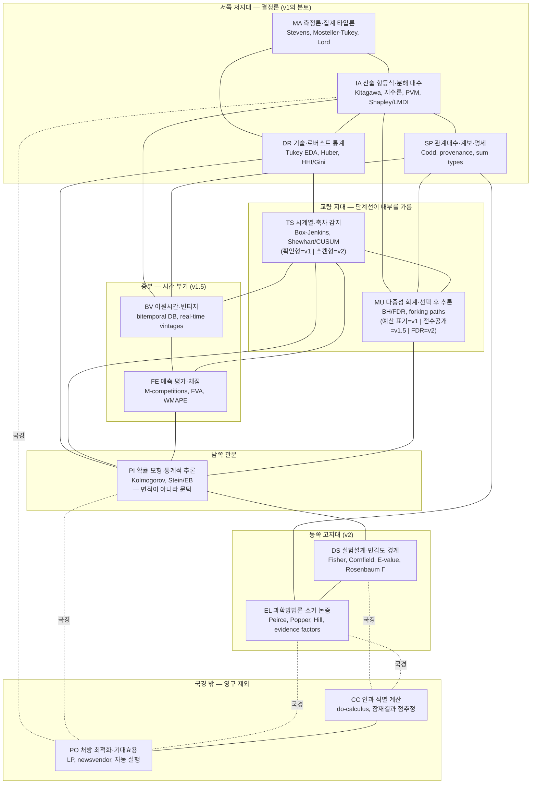

# 정보 산출물 카탈로그 — 수학·통계학 지도 위의 맵핑

> 정보 산출물 22종을 결정 앵커(누가 소비하나), 인식론적 사다리(무엇을 주장하나)에 이은
> 세 번째 조직축 — **수학·통계학의 지형(어떤 수학 위에 서 있나)** — 으로 배열한 카탈로그.
> [legacy-notes.md](legacy-notes.md)의 원리 P1~P8·함정 대장,
> [operator-registry-v1.md](operator-registry-v1.md)의 레지스트리 v1.1을 전제한다. (2026-08 작성)
>
> 방법: 지도 설계 2안(하향식 정통 분류 / 상향식 산출물 해부) 경쟁 → 병합 → 3그룹 맵핑 →
> 국경선 분석의 4단계 패널.

---

## 0. 핵심 결론 — 지도가 보여주는 것

1. **v1은 결정론적 산술의 왕국이다 — 예외는 정확히 하나.** v1 산출물 7종 중 6종의
   distributional_assumptions는 문자 그대로 빈 목록이고, 유일한 확률 접촉(임계 알림의 SPC
   잔차 독립성 가정)조차 게이트가 아니라 ledger에 격리된다. v1은 확률을 **소비하는 지점 0,
   기록하는 지점 1**의 왕국이다.
2. **v1→v1.5 국경은 수학적 국경이 아니라 인프라 국경이다.** 새 정리도 새 확률공간도 필요
   없다 — 필요한 것은 불변 기록(빈티지·append-only 로그), 정의 동일성(버전 게이트),
   사전 선언(척도·벤치마크·임계·대조 창)이라는 세 가지 **기록 계약**뿐이다.
3. **진짜 수학적 국경(v1.5→v2)은 세 검문소로 갈라진다**: 절차의 확률(FDR 예산 — 18번),
   데이터의 확률(uncertainty_model — 21번), 그리고 확률을 전혀 내지 않는 무확률 통로(소거
   논증·민감도 부등식 — 20·22번). "v2 = 확률 도입"이라는 도식은 세 번째 검문소 때문에 틀린다.
   트랙 E(§6) 편입으로 **제4의 검문소 — 설계의 확률**이 추가되었다: Fisher 무작위화 검정의
   귀무 분포는 데이터에 대한 가정이 아니라 시스템이 수행한 할당 행위 자체에서 나온다.
4. **영구 봉인선은 세 가지 재질이다**: 인과 판정은 수학적 경계와 일치(검증된 인과 DAG는
   이 시스템의 데이터 축적으로 원리적으로 공급 불가), 최적화는 수학적으로 가능하나 전제를
   의도적으로 비운 인식론적 선, 자동 실행은 라벨 체계의 인간 독자라는 아키텍처 불변조건의 선.
5. **밀도는 서고동저(西高東低)다**: 항등식 대수는 15개 산출물이 밟는 최고 밀도 지역, 확률
   관문은 1개(21), 설계·민감도는 1개(20)만 core로 밟는다 — "가정 없는 산술을 최대로 착취하고
   가정 있는 수학은 최소로 차입한다"는 전략의 지도상 지문.

---

## 1. 지도 — 13개 영역



| 코드 | 영역 | 다루는 것 (요약) | 정전 앵커 |
|---|---|---|---|
| MA | 측정론과 집계 타입론 | 수치에 허용되는 연산·집계. 타입 어휘, 분모 가중 평균 강제(=Simpson의 대수적 차단), 계산/해석 허용성 분리. **가정 부하 0의 진입 관문(C1)** | Stevens 1946, Mosteller & Tukey 1977, Krantz et al., Velleman & Wilkinson 1993, Lord 1953 |
| IA | 산술 항등식과 분해 대수 | 확률 없는 선언된 항등식 위의 잔차 0 분해: 가법 분할(MECE 격자), 곱셈형(지수 분해), flow-stock, VRM, 교호작용 배분 공리. **교과서에 독립 장이 없지만 이 시스템의 제1영역** | Kitagawa 1955, Oaxaca-Blinder, Laspeyres/Paasche/LMDI, Shapley, SNA 회계 항등식, Adtributor, Gray et al. 1996 (Data Cube) |
| SP | 관계 대수·계보·명세 형식론 | 계산의 구조 자체: 명세/실행 분리, why-provenance, 연산자 DAG, 합 타입 부분함수, 동결·버전 설정. **사전 등록 = 데이터 보기 전의 명세 동결** | Codd 1970, provenance semirings, Wilkinson-Rogers 1973, Hoare/design-by-contract |
| DR | 기술통계와 로버스트 통계 | 모형 없는 요약과 그 요약의 휘둘림: 중앙값/MAD/윈저화, breakdown point, 집중도. **v1에서 영토가 아니라 "모든 분해에 따라붙는 그림자"(무조건 병기 companion)** | Tukey 1962/1977, Huber & Ronchetti, Hampel, HHI/Gini |
| TS | 시계열 해석과 축차 감지 | 시간 구조와 변화 감시: 계절 조정(무조건), CUSUM/SPC, ARL, 자기상관의 오경보 효과. **확인형/스캔형으로 단계선이 내부를 가르는 교량** | Box & Jenkins, Shewhart 1931, Page 1954, Wald 1947, STL/X-13 |
| BV | 이원 시간과 빈티지 구조 | (사건 시간 × 기록 시간) 격자의 부기 수학: as-of 고정, vintage drift, lag 색인, 불변 결정 로그. **v1.5 전체의 존재 증명** | Snodgrass bitemporal, Croushore & Stark vintages, run-off triangle, event sourcing |
| FE | 예측 평가와 채점 | 미래 진술의 사후 채점: WMAPE/bias/tracking signal, FVA 단계 귀속, rolling-origin. **핵심 규율: 채점은 산술(문턱 이쪽), 생성은 문턱 너머** | M-competitions, Hyndman & Koehler 2006, Gilliland FVA, Trigg 1964, Tashman 2000 |
| MU | 다중성 회계와 선택 후 추론 | 탐색 자유도의 유한화와 과금: 표면 사전 열거, FDR 예산, "N스캔 k보고", winner's curse. **유일하게 4단계 전부에 층서화된 영토** | Benjamini & Hochberg 1995, Simmons et al. 2011, Gelman & Loken, 임상시험 사전 등록 |
| PI | 확률 모형과 통계적 추론 | 불확실성의 공리화, 표본→estimand 논증, 경험적 베이즈 shrinkage. **면적이 아니라 관문 — 넘는 순간 uncertainty_model 의무 + '확인' 라벨 영구 불가** | Kolmogorov 1933, de Finetti, Stein/James-Stein, Efron & Morris, Gardner & Altman 1986 |
| DS | 실험설계·관찰연구와 민감도 경계 | 할당 메커니즘이 허용하는 해석, 인과를 계산하지 않는 취약성 정량화(부등식·bounds). **CC 국경까지 가되 넘지 않는다** | Fisher 1935, Cornfield 1959, E-value, Cochran 1965, Rosenbaum Γ, Manski |
| EL | 과학방법론과 소거 논증 | 가설-증거의 논증 구조: 가추, 함의 열거(elaborate theories), 음성 대조, 기각·미검사 함의의 전수 회계. **종합 판정은 절대 자동화 안 함** | Peirce, Mill, Popper, Platt 1964, Mayo, Hill 1965, evidence factors |
| CC | [영구 제외] 인과 식별 계산 | do-연산, 백도어/프론트도어, 잠재결과 점추정. **국경은 지도에 있어야 국경이다** | Pearl, Rubin 1974, Neyman 1923 |
| PO | [영구 제외] 처방 최적화·기대효용 | LP/동적계획, newsvendor, 기대효용, 자동 실행 | Dantzig, Bellman, vN-M/Savage/Wald, Birge & Louveaux |

---

## 2. 산출물 × 영역 매트릭스

●core ○supporting. AVOID 열은 **수학적으로 인접·자연스럽지만 의도적으로 밟지 않는 영역**.

| # | 산출물 (단계) | core | supporting | 의도적 회피 |
|---|---|---|---|---|
| 1 | ad-hoc 지표 조회 응답 (v1) | ●MA ●SP | ○IA | DR(즉석 요약통계), PI(조회값은 추정이 아님) |
| 2 | 정기 변동 브리핑 (v1) | ●IA | ○MA ○SP | TS(유의성 판정=C3 의례 부활), PI(모형 없는 shrinkage), CC |
| 3 | "왜 빠졌어?" 답변 메모 (v1) | ●IA ●EL(맹아) | ○MU(예산 표기) | CC(P6의 v1 구현), PI(winner's curse는 보정 대신 공개), DS(민감도는 v2) |
| 4 | 증거 패키지 열람본 (v1) | ●SP | ○IA ○EL | EL의 판정 자동화("C6" 금지), CC(Pearl화), PI(ledger는 기록이지 검정 아님) |
| 5 | 임계 알림 + 트리아지 (v1) | ●TS(확인형) ●IA | ○MU ○SP | TS 스캔형(봉인), PI(모형 교체 안 함), PO(임계 최적화·자동 대응) |
| 6 | embedded 셀 설명 카드 (v1) | ●IA | ○SP ○MU(저예산) | 3번으로의 무단 승격(권위 세탁), EL 형식의 흉내 |
| 7 | report-as-config (v1) | ●SP | ○MU(동결=사전등록) ○MA | 조건부 분기의 config 반입, 전략 정본화(P4), PO(자동 실행 트리거) |
| 8 | 계획 대비 variance 분해 (v1.5) | ●IA ●BV | ○MA ○SP | PI(잡음 판정), CC(미달의 '원인'), PO(계획 수정안) |
| 9 | 예측 정확도 스코어카드 (v1.5) | ●FE ●BV | ○MA ○IA | PI(Diebold-Mariano 검정), FE 생성 측, PO |
| 10 | FVA 리포트 (v1.5) | ●FE ●IA | ○BV ○SP | CC(단계 제거의 반사실), PI(유의성), PO("단계를 폐지하라") |
| 11 | 계획 편향 진단 (v1.5) | ●FE ●DR | ○BV ○MA | PI(sign test), 의도 귀속(판단 라벨로만), 선택 보고(전수 공개로 소거) |
| 12 | 수요-공급 gap (v1.5) | ●IA(flow-stock) ●BV | ○MA ○SP | **PO(정의적 국경 — "얼마를 더 생산?"이 국경 횡단)**, PI(수요 분포), CC |
| 13 | 시나리오 비교표 (v1.5) | ●IA ●BV | ○SP(동결 DAG) ○MA | PO(생성·추천·순위화), PI(확률 가중), CC(개입 효과 서술) |
| 14 | 예외 관리 목록 (v1.5) | ●MU(무확률 극한) ●IA | ○SP | 적응적 임계(함정 5), 선택 보고 |
| 15 | 합의 조정 감사 (v1.5) | ●BV ●FE | ○IA ○SP | CC("동반 이동 기술까지"), 인사 평가 전용(거버넌스 경계) |
| 16 | 계획 버전 간 비교 (v1.5) | ●BV ●IA | ○MA | 자동 폴백(정의 불일치 시 out_of_domain) |
| 17 | 결정-결과 추적 (v1.5) | ●BV | ○IA ○TS | 결정이론적 판정("옳은 결정이었나"), CC — **순수한 이원 시간 대조 산술** |
| 18 | 정기 감지 리포트 (v2) | ●MU(FDR) ●TS(스캔형 개봉) | ○SP ○DR | IA 자동 드릴다운 연쇄(함정 1), PI 본진입(적응형 임계) |
| 19 | 탐색 세션 메모 (v2) | ●DR(봉인의 유일 합법 채널) ●MU(부채 각인) | ○SP | PI(유의성 부여 금지), EL(증거 패키지 승격 금지) |
| 20 | 진단 증거 패키지 "RCA" (v2) | ●EL ●DS | ○IA ○SP ○TS | CC(do-연산·점추정), EL 내부의 판정 자동화(Hill 체크리스트화) |
| 21 | 기저 예측 + 오차 귀속 (v2+) | ●PI(**관문 통과자** — 트랙 E의 26번과 둘뿐) ●FE | ○BV ○TS | PO(newsvendor 미진입), CC 방향 서사 |
| 22 | 처방 후보 메모 (v2) | ●EL(Toulmin형 증거 계류) | — | PO(전부), CC(개입 판정은 인간에게 라벨로 귀속) |

**영구 제외 항목의 좌표**: 인과 판정·witness-do-연산 → CC (전 엣지의 인과 검증이라는, 데이터
축적으로 갚아지지 않는 부하), 계산된 처방·최적화 → PO (수요 분포 + 개입 효과 + 목적함수
정당화의 삼중 전제를 의도적으로 미공급), 자동 실행 → 지도 밖이 아니라 **지도의 독법 자체의
부정**(라벨 체계의 인간 독자 제거).

---

## 3. 국경선 분석 — 단계는 지도 위의 어떤 행군인가

### v1: 서쪽 저지대의 결정론 왕국

두 개의 심장을 가진 이축 국가 — **IA가 계산의 심장**(2·3·5·6은 전부 가법 항등식의 변주),
**SP가 구조의 심장**(1·4·7은 명세·기록·동결). MA가 모든 입국 심사(C1)를 담당하는 관문 도시.
DR은 영토가 아니라 그림자(무조건 병기), TS는 확인형 반쪽만. 모든 수치는 회계 수치이지 모수의
추정이 아니며, 표본 개념이 없으므로 불확실성 필드도 없다.
**진입 통행료: design facts(타입·항등식·grain 선언)뿐 — 가정 부하 0이 진입 조건 그 자체.**

### v1 → v1.5: 인프라 국경 (수학 국경 아님)

comparison_basis를 plan(빈티지 고정)으로 치환하면 v1 산술이 통째로 이월된다(8·12·13·16).
채점은 기록된 빈티지 vs 실적의 사칙연산이라 확률 없이 성립한다(9·10·11·15).
**통행료는 세 가지 기록 계약**: (a) 불변 기록 — as-of 재현, append-only 로그, (b) 정의
동일성 — 빈티지 간 버전 게이트, (c) 사전 선언 — 척도·벤치마크·임계·대조 창의 사전 동결.
확률공간은 하나도 추가되지 않는다 — 추가되는 것은 기록 시간이라는 두 번째 시간 축뿐.
BV가 10개 산출물 중 8개의 core로 등장하는 병목 자원이다.

주목: **사전 선언 계약(c)의 의미** — 확률 없는 산출물에서도 사후 선택(척도·벤치마크·창 선택)은
forking paths를 만든다. 다중성 회계는 확률 영역이 아니라 절차 영역임을 v1.5가 이미 보여준다.
v1.5의 다중성 대응 원리는 일관되게 "전수 공개는 선택 후 추론 문제를 소거한다"(11·14·15)이다.

### v1.5 → v2: 세 개의 독립 검문소

- **검문소 A — 절차의 확률** (→18): 스캔 통계량의 귀무 분포·잔차 독립성 가정 위의 FDR 보장.
  확률의 대상이 데이터 모형이 아니라 분석 절차의 오류율.
- **검문소 B — 데이터의 확률** (→21): 시계열 생성 모형, uncertainty_model 명시 의무,
  rolling-origin 백테스트(v1.5의 빈티지 인프라가 전제). 카탈로그 22개 중 **유일한** PI 관문
  통과자.
- **검문소 C — 확률 무관** (→20·22): 필요한 것은 가설 객체·검증 가능 함의·음성 대조·증거 계류
  참조라는 **논증 형식론**과 라벨 분리 규율("부등식은 데이터 확인 / 요인의 실존성은 컨설턴트
  판단")뿐. Cornfield 부등식은 식별 가정 불요의 종이-연필 수학이다.

### 영구 제외: 삼면 포위의 진형

행군은 최동단에서 멈추는 것이 아니라 **CC를 삼면에서 포위하되 밟지 않는 진형**으로 완성된다 —
민감도 부등식(DS)이 남쪽에서, 소거 회계(EL)가 북쪽에서, 항등식 환원(IA — 12·13)이 서쪽에서
국경을 압박한다. "최종 산출물은 인과 계산이 아니라 증거 패키지"(P6)라는 아키텍처 결정이
이 포위 진형의 기하학 그 자체다.

**요약 — 각 단계는 '더 많은 확률'이 아니라 '다른 종류의 계약'을 추가하며 전진한다**:
v1은 선언 계약, v1.5는 기록 계약, v2는 오류율 계약(또는 논증 계약). 영구 제외선은 어떤
계약으로도 살 수 없는 것(검증된 인과 구조)과 사서는 안 되는 것(인간 독자의 제거)을 표시한다.

---

## 4. 구조적 통찰

### 4.1 단계선은 영토 경계가 아니라 영토 내부의 체제(regime) 선이다

로드맵이 단계별로 새 수학 영토를 정복하며 전진한다고 상상하기 쉽다 — v1은 산술의 땅, v1.5는
시간의 땅, v2는 확률의 땅을 차례로 점령한다는 그림이다. 그러나 맵핑 결과는 그 그림을
부정한다. 단계선은 대부분 영토와 영토 사이가 아니라 **한 영토의 한복판을 지나간다**.

v1과 v1.5를 가르는 선은 산술 항등식 대수(IA)의 내부를 지난다: 세그먼트 기여도 분해와 계획
대비 variance 분해는 완전히 같은 항등식 산술이고, 달라지는 것은 comparison_basis라는 파라미터
값 하나(전기 → 계획 빈티지)다. v1.5와 v2를 가르는 선도 마찬가지로 세 영토의 내부를 지난다:
다중성 회계(MU) 안에서는 "전수 공개"와 "FDR 예산"이, 시계열 감지(TS) 안에서는 확인형과
스캔형이, 로버스트 통계(DR) 안에서는 companion 병기와 세션 채널이 단계로 갈라진다. 같은
수학이 계약 조건에 따라 다른 단계에 속하는 것이다.

영토 경계와 단계선이 일치하는 곳은 지도 전체에서 단 하나 — 확률 관문(PI)뿐이다. 이것이
"관문은 면적이 아니라 문턱"이라는 은유의 정확한 의미다. 실무적 함의는 분명하다: **단계
승급의 비용은 대부분 새 수학을 배우고 구현하는 비용이 아니라, 파라미터를 일반화하고 절차
계약(선언·기록·예산)을 지키는 비용이다.** 수학 영토의 실제 정복은 기저 예측(21번) 단
한 곳에서만 일어난다. 이는 P1(목록이 아니라 좌표계)의 지도상 재확인이기도 하다 — 성장은
연산자 목록의 연장이 아니라 기존 좌표축 위의 새 값이다.

### 4.2 다중성 회계는 4단계 전부에 층서화된 유일한 영토다 — 지불 방식만 정교해진다

다중성 회계(MU)는 지도에서 특이한 지위를 갖는다. 다른 영토들은 특정 단계에 속하거나 특정
단계에서 개봉되는데, MU만은 v1부터 영구 제외 직전까지 **모든 단계에 층을 이루며 존재한다**.

v1에서는 확률 없는 절차 회계로 나타난다: 탐색 예산의 사전 상한, 스캔된 후보 시점 수의 노출,
"이 결론은 N개 경로 중 선택된 것"이라는 라벨. v1.5에서는 선택의 제거로 나타난다: 예외 관리
목록(14번)은 다중성 문제를 오류율 계산으로 푸는 게 아니라 사전 고정 임계와 전수 공개로
선택 자체를 없애서 푼다 — 선택이 없으면 선택 후 추론 문제가 발생하지 않는다. v2에 이르러서야
확률이 등장한다: FDR 예산의 선언과 집행(18번), 그리고 그 쌍대인 미과금 부채의 명시적
각인(19번의 '참고치' 라벨 — 다중성 부채를 갚지 않았음을 라벨로 새기는 지불 유예).

같은 영토 안에서 단계가 올라갈수록 **지불 방식만 정교해지는** 이 층서가 말해주는 것: v2의
스캔 개봉은 새 수학의 도입이 아니라, 이미 깔려 있는 절차 회계 위에 확률 계산을 얹는 것이다.
따라서 v2를 준비하는 최선의 방법은 FDR 문헌을 공부하는 것이 아니라 **v1의 예산 표기 규율을
지금부터 엄격히 지키는 것**이다. 예산 필드가 형식적으로 채워지는 순간, 나중에 그 위에 얹을
오류율 보장은 처음부터 성립하지 않는다.

### 4.3 카탈로그는 보이는 것보다 작다 — 같은 좌표의 두 점, 다른 축의 두 점

산출물 22종은 목록으로는 많아 보이지만, 지도 위에서는 소수의 좌표에 밀집해 있다. 두 쌍의
대비가 이를 보여준다.

"왜 빠졌어?" 답변 메모(3번)와 embedded 셀 설명 카드(6번)는 **지도상 완전히 동일한 좌표**에
있다. 같은 항등식 대수, 같은 분해 연산자, 같은 라벨 체계. 다른 것은 exploration_budget의
값뿐이다 — 메모는 깊은 예산으로 소거 논증의 맹아까지 가고, 카드는 max_depth 1~2의 극소
예산으로 첫 항만 보여준다. 산출물 두 개가 아니라 한 점의 두 파라미터화다.

반면 임계 알림(5번)의 확인형과 봉인된 스캔형은 **같은 CUSUM 수학이면서 다른 축의 값이 다른**
경우다. 가르는 축은 예산이 아니라 external_criterion — 하야시가 모든 방법을 조직할 때 제1
분류자로 삼았던 "외적 기준의 유무"다. 사전 선언된 (지표×임계)의 감시는 외적 기준이 있는
확인이고, 전 지표를 훑는 것은 외적 기준이 없는 탐색이며, 전자는 v1이고 후자는 봉인이다.
70년 전의 분류 축이 오늘의 admissibility를 실제로 가르고 있다.

### 4.4 예측 평가 영토를 반으로 가르는 선 — 채점과 생성

예측 평가(FE)는 교과서라면 한 장(章)으로 묶일 내용이다. 그런데 단계선이 이 영토를 정확히
반으로 가른다. 채점 — 정확도 스코어카드(9), FVA(10), 편향 진단(11), 조정 감사(15) — 은 전부
v1.5다. 기록된 예측 빈티지와 실현된 실적의 사칙연산이기 때문이다. 표본도, 모형도, 확률공간도
없다. 그러나 같은 영토의 생성 측 — 기저 예측(21)과 예측 비교 검정(Diebold–Mariano) — 은
문턱 너머 v2+다. 미래 값의 분포라는 estimand가 등장하는 순간 uncertainty_model 명시 의무가
발동하고 '확인' 라벨이 영구히 불가능해진다.

이 절단이 실무적으로 중요한 이유: S&OP 도메인에 진입할 때 "예측 기능"을 하나의 덩어리로
보면 전부 무거워 보이거나 전부 가벼워 보인다. 지도는 그 덩어리를 가른다 — **예측을 채점하는
일은 계획 대비 분해와 같은 급의 산술이므로 즉시 가능하고, 예측을 만드는 일은 카탈로그 전체에서
가장 무거운 산출물이므로 가장 나중이다.** "기록하고 채점하는 층이 먼저, 만드는 층은 채점
인프라 위에서"라는 v1.5 경계 원칙은 이 절단의 직접적 귀결이다.

### 4.5 국경 수비의 비대칭 — 실제로 시험받을 국경은 인과가 아니라 최적화 쪽이다

인과 계산(CC) 국경은 이 설계에서 가장 두텁게 방어된다. 남쪽에서 민감도 부등식(DS)이, 북쪽에서
소거 논증(EL)이, 서쪽에서 항등식 환원(IA)이 국경을 삼면 포위하고, 타입 시스템(output_type에
Cause 부재)과 서사 린트가 최후방을 지킨다. 설계 논의의 대부분이 이 국경에 투입되었다.

그런데 맵핑이 드러낸 것은 **실전에서 압력을 받을 국경은 반대쪽**이라는 사실이다. 처방
최적화(PO) 국경의 수비는 상대적으로 얇다: 수요-공급 gap(12)이 최적화 요구를 flow-stock
항등식의 산술 전개로 받아내는 환원 기법 하나, 시나리오 비교(13)의 "평가만, 생성 안 함"이라는
계약 하나, 처방 메모(22)의 판단 라벨 의무 하나가 전부다. 그리고 S&OP라는 도메인 자체가
교과서 관행으로 "검정하라, 원인을 찾으라, 최적화하라"를 요구하는 곳이다.

가장 위험한 지점은 구체적으로 짚을 수 있다. gap 정량화(12번)는 "수요 계획과 공급 능력의
차이는 3천 개"까지 말한다. 사용자의 다음 질문은 필연적으로 "그래서 얼마를 더 생산해야
하나?"이고, 이 **질문 하나의 차이로 산출물은 국경을 넘는다** — 산술 전개가 newsvendor 최적화가
되고, 기술이 처방이 된다. 인과 국경은 삼중 방어 덕에 사고가 나기 어렵지만, 이 지점은 운영
중 상시 감시가 필요하다.

### 4.6 국경 방어는 산출물의 미덕이 아니라 타입 시스템의 상속이다

마지막 통찰은 방어의 위치에 관한 것이다. 22개 산출물의 avoided 목록을 나란히 놓으면 인과
계산 회피가 모든 산출물에 반복되는데, 이것은 산출물 하나하나가 각자 조심한 결과가 아니다.
**단일한 레지스트리 수준 결정 — output_type 열거에 Cause가 존재하지 않는다는 것, 그리고
서사 린트가 Attribution의 인과 문장 렌더링을 차단한다는 것 — 에서 일괄 파생된 것이다.**

이 구분이 중요한 이유는 확장성에 있다. 국경 방어가 산출물 레벨에 있다면 새 산출물을 추가할
때마다 설계자가 같은 경계심을 반복해야 하고, 언젠가 한 번은 잊는다. 방어가 타입 시스템에
있으면 신규 산출물은 등록되는 순간 국경을 자동 상속한다. R&D·실험 계열처럼 카탈로그가
확장될 때 이 성질이 실제 안전망이 된다.

## 5. 공백 지역 — 기회와 올바른 회피

- **[진짜 공백 → 해소됨] DS의 실험 설계 측**: assignment_mechanism에 randomized가
  존재하고 승격 판정 근거로 쓰이는데, 무작위 할당 데이터의 분석을 전담하는 산출물이
  카탈로그에 없었다. 무작위화는 인과 국경을 넘는 가장 저렴한 합법 통로다(Fisher 검정은 할당
  메커니즘 자체가 귀무 분포를 공급해 모형 가정이 최소). **설계자의 지시(R&D까지 확장 —
  experiment design, A/B test)로 트랙 E(§6)로 정식 편입되어 이 공백은 해소되었다.**
- **[올바른 회피] proper scoring의 유인 정합성 이론, 예측 비교 검정, 경험적 베이즈의 본격
  전개, Manski 부분 식별**: 전부 확률 관문 너머의 자연 확장이지만 현 라벨 체계 하에서 '시사'
  상한이므로 투자 대비 지위가 낮다는 일관된 논리로 회피된다.

---

## 6. 트랙 E — R&D 실험 계열 (experiment design · A/B test)

> §5가 "진짜 공백"으로 지목했던 무작위 할당 영역을, 설계자의 지시(R&D까지 확장)로 정식
> 편입한 것. **v2의 내부 단계가 아니라 병렬 트랙**이다 — 근거 세 가지: (a) 국경 논리가 다르다
> (관찰 트랙은 인과 국경을 포위하되 밟지 않지만, 실험 트랙은 무작위화라는 합법 통로로 **제한된
> 국경 통과**를 한다), (b) 확률의 원천이 다르다(검문소 D — 설계의 확률), (c) 실험 플랫폼(할당
> 실행·로깅 인프라)이라는 **외생 전제**는 내부 성숙으로 해소되지 않는다.

### 6.1 산출물 (#23~28)

| # | 산출물 (단계) | core | 요점 |
|---|---|---|---|
| 23 | 실험 설계 문서 (E1) | ●SP ●DS | 가설·OEC·가드레일·MDE·검정력·표본 크기·할당 방식의 **데이터 수집 전 동결**. Fisher 1935의 직계 — 사전 등록(SP) 철학의 문자적 실현. 검정력 계산의 분산 추정은 과거 데이터 차입이라는 조용한 PI 접촉 — '계획 수치' 라벨 + 분산 출처 ledger 명시 의무 |
| 24 | 무작위화 건전성 점검 (E1) | ●DS | SRM(sample ratio mismatch — Kohavi 계열이 "가장 중요한 단일 품질 지표"로 정식화), 공변량 균형, A/A 테스트. **귀무 분포가 데이터 모형이 아니라 선언된 할당 메커니즘에서 나오는 유일한 검사 부류** — 확률이 '가정'이 아니라 '제조된 사실'. 판독(#26)의 하드 게이트. 실패 시 자동 보정 금지 — 데이터 불신임 사유 |
| 25 | 실험 중간 모니터링 (E2) | ●TS ●MU | peeking 문제(Armitage et al. 1969)의 축차 해소: 군축차 설계(Pocock, O'Brien–Fleming), 알파 소비(Lan–DeMets), always-valid inference(Johari et al. 2017). **알파 소비 = 다중성 예산의 시간 버전** — MU가 트랙 E에도 층서화. 고정표본 p값은 중간 스키마에서 필드 자체를 제거 |
| 26 | 실험 판독 보고서 (E2) | ●DS ●PI | **'효과' 어휘가 조건부 합법화되는 유일한 산출물.** Fisher 무작위화 검정, Neyman 분산, CUPED(사전 선언 시), 사전 등록 지표의 BH 보정. output_type에 **Effect 신설**(Cause는 여전히 부재) — estimand는 실험된 모집단·기간·처치에 국한된 평균 처치 효과. 21번과 함께 PI 관문 통과자 둘뿐 |
| 27 | 실험 등록부 (E1) | ●SP ●BV | 전 실험의 append-only 사전 등록 — file-drawer 선택 편향의 소거. "선언이 데이터보다 앞섰다"는 명제 자체가 빈티지 대조로만 증명 가능(v1.5 인프라의 직접 재사용). **트랙 E의 병목 자원** |
| 28 | 실험 간 메타 회고 (E2+) | ●MU ●FE | 실험 프로그램 자체의 채점: 승률, 검정력 부족 비율, 출시 편향(winner's curse의 실험 간 재등장 — 경험적 베이즈 shrinkage는 '시사' 상한) |

**'효과(Effect)' 승격의 4중 조건**: assignment_mechanism=randomized(설계 사실) AND 무작위화
건전성(#24) 통과 AND 사전 등록 지표 AND 다중성 회계. 이 조건은 산출물별 규율이 아니라
타입 시스템에 인코딩되어 일괄 상속된다(§4.6의 강점 재사용).

### 6.2 검문소 D와 제4의 계약 — 할당 계약 (assignment contract)

기존 서사의 세 계약(v1 선언 → v1.5 기록 → v2 오류율/논증)은 전부 **주어진 데이터를 어떻게
분석하는가**에 대한 계약이다. 할당 계약은 종류가 다르다: 데이터가 존재하기 전에 할당
메커니즘을 선언·동결하고(#23·#27 — 선언·기록 계약의 재사용), 물리적 무작위화로 실행하며,
그 실현을 검증한다(#24). 그 대가로 다른 어떤 계약도 살 수 없는 것을 산다 — **설계가 공급하는
귀무 분포**. 같은 도로의 다음 검문소가 아니라 직교하는 축이다.

국경 지도는 수정되지 않는다. 할당 계약이 사는 것은 실험된 범위에 국한된 Effect이지 일반
인과 구조(CC)가 아니므로, 삼면 포위 진형은 유지되고 실험 트랙은 **제한된 통행증이 발급되는
검문 통로**로 추가될 뿐이다.

계보적 의미 둘. 하야시의 データの科学 3항(설계→취득→분석) 중 관찰 트랙이 분석을, v1.5의
빈티지 인프라가 취득의 기록을 커버했고 설계는 공백이었다 — 트랙 E가 마지막 항을 채워
하야시가 말년에 도달한 구도를 완성한다. 동시에 Fisher(1935)로의 원점 회귀다: DS 영역의 정전
앵커가 처음부터 Fisher 1935였으나 지금까지는 그 계보의 하류(Cornfield의 민감도 — 실험이
불가능할 때의 차선)만 밟았고, 트랙 E는 앵커의 원류(무작위화 자체)를 개방한다. 흡연-폐암
논쟁에서 Fisher가 관찰 증거에 반대한 바로 그 이유 — 할당 메커니즘 없이는 교란을 배제할 수
없다 — 가, 할당을 시스템이 설계하는 순간 해소되는 구조다.

### 6.3 트랙 E에서도 만들지 않는 것

- **실험의 자동 실행** (자동 출시·롤백·조기 중단) — 판독은 라벨을 읽는 인간 독자를 전제.
- **최적 실험 설계의 자동화** — 검정력 계산기는 제공하되, 무엇을 MDE로 삼을지는 PO 국경 너머의 판단.
- **밴딧·적응적 할당** — 이중 위반: 할당이 곧 최적화가 되어 PO 국경을 데이터 생성 단계에서
  횡단하고, 고정 할당이 공급하던 귀무 분포와 SRM 개념을 붕괴시켜 검문소 D의 기반을 침식.
- **do-calculus·transportability에 의한 일반화 계산** — 외적 타당성 언명은 '컨설턴트 판단'로만.
- **관찰 데이터의 유사실험 자동 승격** — matching·성향점수로 randomized 지위를 부여하는 것은
  assignment_mechanism의 거짓 선언(WHI 반전의 교훈). 관찰 비교는 관찰 트랙의 규율에 남는다.
- **실험 가설의 자동 대량 생성**, **SRM 검출 시 자동 보정**(사후 재가중·재할당).

### 6.4 함정 대장 확장 (11~15)

11. **SRM 미검출** — 신규. P2′ 삼분류에 없는 제4부류 **설계 실현 검사(design realization
    checks)** 신설 필요. 주의: SRM 검사 후 판독 차단은 사전검정 함정(5번)이 아니다 — 귀무가
    설계에서 공급되고, 실패의 귀결이 방법 교체가 아니라 데이터 불신임(out_of_domain)이다.
12. **peeking** — 중간 채널에는 조건 없이 항상 축차 보정 통계량만("무조건 robust 기본값"
    원리의 실험판). 계산해선 안 되는 것은 필드가 없다.
13. **다중 지표 체리피킹** — **유일하게 기존 체계로 방어됨**(SP 동결 + MU 전수 공개 + 서사
    린트 + 함정 6). 등록부 참조 없는 지표의 '효과' 서술은 린트가 차단, 사후 지표는 '시사' +
    차기 실험 가설로 라우팅.
14. **novelty/primacy effect** — 효과의 시간 프로파일을 판독 필수 필드로(기존 TS 확인형
    재사용), "관측 효과가 정상 상태를 대표한다"는 외삽 가정은 ledger의 uncheckable 일급 항목.
15. **interference (SUTVA 위반)** — 할당 단위와 간섭 경로 후보의 선언 의무(#23). 그래프
    witness의 새 용법: 실체 관계 경로를 간섭 채널 후보의 탐지 증거로 쓰되 '시사' 상한 유지.

---

## 7. 실행 골격 — 흐릿하게 본 절차와 층의 배치

> 눈을 흐릿하게 뜨고 논리적 뼈대만 추스른 것. 카탈로그·지도가 "무엇을 만드나"였다면
> 이 절은 "실행 시점에 무엇이 어떤 순서로 일어나나"다.

### 7.1 절차의 뼈대 — LLM 샌드위치

한 줄 요약: **이 시스템은 LLM 샌드위치다.** LLM은 양끝(이해와 작문)과 중간의 선택 한 번에만
등장하고, 몸통은 전부 이름 없는 평범한 결정론적 코드다. 이름이 없는 이유는 업계가 LLM이 닿는
가장자리에만 이름을 붙였기 때문이다(nl2sql, RAG, prompting) — 가운데는 그냥 소프트웨어라서
유행어가 없다.

```
질의
 │
 ① 해석          (LLM)      질의 → 의도·질문 서명: 외적 기준 유무, 수준/변화/구성/분포
 ② 바인딩        (LLM+사전)  지표·기간·차원·타입 확정 — semantic layer 사전을 제약으로.
 │                           모호하면 반문 또는 X1 반환 (전진 금지)
 ③ 방법 선택     (LLM, 제한됨) 격자가 허용 연산자 집합을 좁힘 → LLM이 그 안에서 선택 → 선택 기록
 │
 ┌──── 몸통 = LLM 없음 (문서 1~4권이 이 구간의 사양서다) ────┐
 ④ 컴파일        (코드)      선언적 명세 → SQL / TypeQL 생성·실행
 ⑤ 계산·검증     (코드)      분해 산술, Σ기여==Δ전체 재계산, 게이트 판정, robust 짝 병기
 ⑥ 증거 조립     (코드)      수치+공식+witness 경로+가정 원장+탐색 기록 → Evidence Bundle
 ⑦ 라벨 부여     (코드)      필드별 '확인/시사/판단' 상한의 기계 판정
 └──────────────────────────────────────────────────────┘
 │
 ⑧ 작문          (LLM)      템플릿 + Evidence Bundle → 보고서 문장 (숫자는 번들에서만 인용)
 ⑨ 린트          (코드)      수치↔출처 참조 검사, 인과 동사 검사 → 통과 시 출력
```

화살표는 한 방향이 아니다 — 왕복이 두 개 있다: ②에서 모호하면 사용자에게 되돌아가는
루프(반문), ⑤에서 분해 결과가 파볼 가치가 있으면 ③으로 되돌아가는 루프(드릴다운 — 예산
상한부). **이 두 왕복을 빼면 파이프라인이고, 넣으면 에이전트다.**

주의: nl2sql이 아니라 **nl2spec + spec2sql**이다. LLM은 선언적 명세까지만 쓰고 SQL은
컴파일러가 쓴다. 이 한 칸의 분리가 신뢰 구조 전체의 물리적 위치다. 그리고 LLM이 등장하는
칸 중 ①②③은 설계가 두껍고 ⑧이 가장 얇다 — "작문 미설계" 비대칭이 이 그림에서도 보인다.

### 7.2 몸통의 코드는 누가 쓰는가 — 두 개의 시점

코딩은 LLM이 한다. 단 **언제 쓰느냐가 신뢰 구조의 전부다.**

- **개발 시점 — LLM이 쓴다.** 커널 라이브러리(연산자·검사기·컴파일러·번들 조립기)는 LLM이
  작성하되, 수명주기가 다르다: 한 번 작성 → 사람 리뷰 → 테스트(합성 원인 주입 회귀) →
  버전 부여 → 시그니처 동결. 이 과정을 통과한 코드는 더 이상 LLM의 발화가 아니라 검증된
  고정 자산이다.
- **실행 시점 — LLM의 쓰기 권한은 명세에서 끝난다.** 질의 도중 pandas 코드를 즉석 생성해
  돌리는 것(Code Interpreter 방식)은 금지. 이유 넷: (a) 재현성 계약 붕괴(같은 질문+같은
  as-of=같은 답의 주어가 없어짐), (b) '데이터 확인' 라벨의 근거 소멸(검증된 고정 코드가
  만들었다는 보증), (c) 실행 기록의 기계성 붕괴(실행 코드 자체가 LLM 발화면 기록 전체가
  자기보고로 퇴행), (d) 코드 수준의 권위 세탁(계산을 쓴 모델이 결과를 서술).
- **post-condition은 필요조건이지 충분조건이 아니다.** Σ기여==Δ전체는 산술 오류는 잡지만
  *틀린 대상을 옳게 분해한 것*(잘못된 필터·밀린 기간)은 통과시킨다. 의미론의 안정성은
  검증기가 아니라 동결이 보증한다.
- **금지가 아니라 라벨로 흡수한다(P5).** 격자 밖 질문에 대한 즉석 분석 코드는 탈출구로
  허용하되(JMP의 Fit Model 구조), 산출물은 어떤 경우에도 '데이터 확인' 불가('참고치/판단'
  상한) + 즉석이었다는 사실 기록 + 반복되면 정식 연산자 등록(개발 시점으로의 승격) 후보.
  **탈출구가 곧 레지스트리의 성장 경로다.**

| | 코드 작성자 | 시점 | 라벨 상한 |
|---|---|---|---|
| 정식 연산자 | LLM (개발 시점) | 사전 — 리뷰·테스트·동결 후 | '데이터 확인'까지 |
| 즉석 분석 | LLM (실행 시점) | 질의 도중 | '참고치/판단' — 절대 '확인' 불가 |

### 7.3 연산의 배치 — 이분법이 아니라 삼분법

"연산은 semantic layer에 있나 agent layer에 있나"의 답은 둘 다 아니다:

```
semantic layer  —  연산의 정의역을 선언  (타입, 항등식, 집계 규칙)
연산 커널       —  연산의 구현           (동결된 라이브러리 — 제3의 층)
agent layer     —  연산의 선택과 편성    (어느 연산자를, 어떤 순서로, 얼마의 예산으로)
```

경계 기준 한 문장: **지표 정의의 일부인가, 지표에 대한 질문인가.** 집계 규칙(분모 가중
평균)은 정의의 일부 → semantic layer. 분해·변화점·민감도는 정의에 대한 질문 → 커널.

- semantic layer에 연산을 넣지 않는 이유: 선언 저장소에 분석 코드를 넣으면 지표 거버넌스가
  분석 코드 릴리스 주기에 결박된다.
- agent layer에 넣지 않는 이유(더 중요): **커널은 agent 없이 호출·테스트 가능해야 한다** —
  합성 원인 주입 회귀는 커널을 직접 때린다. 커널은 공유 자산이다(보고서·알림·S&OP agent가
  같은 커널 사용). 연산은 agent의 소유물이 아니라 인프라다.
- GLM의 문법으로: semantic layer는 formula 언어의 **어휘**, 커널은 **IRLS**, agent는
  **formula를 쓰는 자**. 물리적 배치: 커널은 데이터 쪽(서버사이드, 버전 관리), agent는
  도구 호출로 건너온다.

### 7.4 연산을 LLM의 질의 해석 아래에 둘 때의 성공 요인

text2sql·chat-BI 계보가 대부분 실패한 지형에서 이 배치가 성공하는 조건 여섯:

1. **닫힌 어휘 착지** — 해석의 출력이 자연어→SQL(무한 공간)이 아니라 사전에 선언된 유한
   어휘로의 분류·바인딩. 해석이 잘 되는 이유는 LLM이 똑똑해서가 아니라 착지 공간이 좁아서다.
2. **모호하면 전진 금지** — 거절할 수 있는 해석기만이 신뢰받는 해석기다(chat-BI가 무너진
   지점이 "항상 답한다").
3. **오류를 탐지 가능한 종류로 몰아넣기** — 가장 깊은 요인. 해석이 틀리면 "틀린 질문에 대한
   옳은 답"(독자가 즉시 알아챔), 계산이 틀리면 "옳은 질문에 대한 틀린 숫자"(아무도 못 알아챔).
   해석은 LLM에게, 계산은 동결 커널에게 주는 배치는 **전체 오류 질량을 탐지 가능한 쪽으로
   몰아넣는 설계**다. 성패는 오류율이 아니라 오류의 종류 분포다.
4. **해석 결과의 물화와 반향** — "이렇게 이해했습니다: 매출[v3], 7월, 전월 대비"를 보고서
   머리에 되비춤. 명세는 SQL과 달리 현업이 감사 가능하다 — nl2spec이 nl2sql보다 나은
   실질적 이유.
5. **해석 실패가 사전을 살찌우는 루프** — 모호성 해소·재캐스팅 기록으로 같은 모호성을 두 번
   묻지 않음. 1980년대 지식 획득 병목의 현대적 해소 경로.
6. **해석 정확도의 측정** — 바인딩 정확도와 abstention P/R 없이는 1~5의 작동 여부를 알 수 없다.

관통하는 한 줄: **성공 요인의 대부분은 LLM 쪽이 아니라 사전 쪽에 있다.** 닫힌 어휘도 모호성
판정도 루프도 전부 semantic layer의 커버리지가 상한을 정한다 — 감사에서 semantic layer
온보딩이 under로 판정된 것이 다시 돌아오는 지점이다.

---

*근거: 4단계 맵핑 패널(2026-08-06) — 지도 설계 2안 경쟁·병합(13개 영역), 산출물 22종 + 영구
제외 3종 맵핑, 국경선 분석. 산출물 정의는 이전 정보 경계 분석(BI/S&OP/EDA 5렌즈 패널)에서 확정.
§4 산문화 및 트랙 E(§6) 편입: 2026-08-06 R&D 확장·감사 패널. §7 실행 골격: 2026-08-06 설계 대화.*
